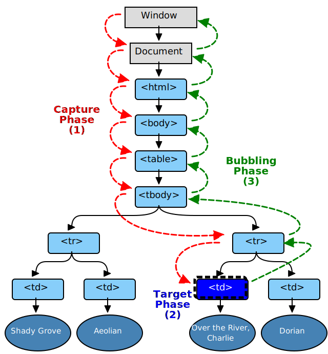

<a name="EventFlow"></a>

### EventFlow

**事件流描述的是从页面中接收事件的顺序, 有意思的是 IE 和 Netscape 开发团队提出了差不多是完全相反的事件流的概念, IE 的事件流是事件冒泡流, 而 Netscape Communicator 的事件流是事件捕获流, 都认为: 假设在一张纸上的一组同心圆, 如果你把手指放在圆心上, 那么你的手指指向的不是一个圆,而是纸上的所有圆**

_IE 的事件叫做事件冒泡(event bubbling), 即事件开始时由最具体的元素(文档中嵌套层次最深的那个节点)接收, 然后主机向上传波到就较为不具体的节点(文档), 例如以下代码展示_

```html
<!DOCTYPE html>
<html lang="en">
  <head>
    <meta charset="UTF-8" />
    <meta name="viewport" content="width=device-width, initial-scale=1.0" />
    <meta http-equiv="X-UA-Compatible" content="ie=edge" />
    <title>Document</title>
  </head>
  <body>
    <div id="test">test</div>

    <script>
      window.onload = function() {
        const div = document.getElementById('test');
        const body = document.body;
        document.onclick = function() {
          console.log('document');
        };

        body.onclick = function() {
          console.log('body');
        };

        div.onclick = function() {
          console.log('div');
        };

        window.onclick = function() {
          console.log('window');
        };
      };
    </script>
  </body>
</html>
```

根据以上代码显示打印的结果分别是从 div 触发, body, document, 从 div 开始触发, 然后 click 事件沿 DOM 树向上传播, 在每一级节点上都会发生, 直至传播到 document 对象, 在 IE5.5 以前会跳过 html 元素, 而之后的浏览器则将事件一直冒泡到 window 对象

_而 Netscape Communicator 团队提出的另一种事件流叫做事件捕获(event capturing), 事件捕获的思想是不太具体的节点应该更早接收到事件, 而最具体的节点应该最后接收事件, 事件捕获的用意在于在事件到达预定目标之前捕获它, 就以以上代码作为示例, 那么触发的应该是 window, document, body, div_

<a name="DOMEventFlow"></a>

### DOMEventFlow

**事件确定了传播路径, 事件对象就会经过一个或多个事件阶段: 捕获阶段, 目标阶段 和冒泡阶段**

- 捕获阶段: 事件对象通过目标的祖先从传播 document 到 目标的父级

- 目标阶段: 本次活动对象到达事件对象的事件目标

- 冒泡阶段: 事件对象通过目标的祖先传播以相反的顺序, 开始于目标的父级和所述结束窗口

<a href="https://www.w3.org/TR/DOM-Level-3-Events/#event-flow" target="_blank" rel="noreferrer">
  
</a>

<!-- 此处在 a 标签中使用 _blank时, 需要加 rel="noreferrer", 阻止通过在新页面中使用 window.opener 修改原页面的信息, 也同样阻止了 Referer header 信息发送到新页面, 以为这新页面中无法判断来源, 通过使用 window.open 打开的新页面, 需要清除掉 opener 信息
const newWin = window.open();
newWin.opener = null;
 -->

[图片来源](https://www.w3.org/TR/DOM-Level-3-Events/#event-flow)

**通过以上图片显示, 在 td 中触发了 click 事件, 刚开始是进入捕获阶段, 从外至内的捕获直至到 tr(父级元素)进入目标阶段, 然后开始逆向的开始传播冒泡程序**

<a name="defaultActions"></a>

### defaultActions

默认行为: 某些事件可用于控制实现下一步可能采取的行为(或撤销实现已执行的操作), 此类别中的时间被认为是可取消的, 他们取消的行为称为默认操作, 可取消的事件对象可以与一个或多个默认操作相关联, 要取消事件调用 preventDefault 方法, 如 在表单提交时使用的 submit, 通常情况下会刷新当前页面, 而调用了 preventDefault() 方法后则可阻止默认行为

<a name="eventHandler"></a>

### eventHandler

**事件处理程序: 事件是用户或浏览器自身执行的某种动作, 如 click load 都是事件的名称, 而相应某个事件的函数就叫做事件处理程序(或事件侦听器), 事件处理程序的名字以 on 开头, 为事件指定处理程序分为几种**

- HTML 事件处理程序, 是通过在标签上添加事件及处理程序, 如: &lt;button onclick="showMessage()"&gt;button&lt;/button&gt;, 在 script 中定义 showMessage 处理程序, 但这样使用会引发问题, 首先,存在一个时差问题, 用户可能在 HTML 元素一出现在页面上就触发响应的事件, 但当时的处理程序有可能尚不具备执行条件, 参考[事件处理程序范围](https://docstore.mik.ua/orelly/web2/action/ch10_07.htm)

- DOM0 级事件处理程序: 就是讲一个函数赋值给一个事件处理程序属性, 需要先取得一个要操作的对象的引用, 对对象添加事件处理程序, 这时的时间处理程序是在这个元素的作用域执行, 也就是说程序中的 this 执行当前操作的对象, 通过对 处理程序函数置空可以删除, btn.onclick = null;

- DOM2 级事件处理程序: 用于处理指定和删除事件处理程序的操作 addEventListener 和 removeEventListener, 所有的 DOM 节点都包含这两个方法, 接收三个参数, 处理事件名, 作为事件处理程序的函数和一个 boolean, 最后这个布尔值参数如果是 true, 表示在捕获阶段调用事件处理程序, 如果是 false 表示在冒泡阶段调用事件处理程序, 默认情况下是在冒泡阶段调用事件处理程序. 同时可以添加多个处理程序, 触发的顺序为添加的顺序. 通过使用 removeEventListener 来移除对事件的监听, 且必须传入与 addEventListener 事件处理的函数名一样的函数, 否则无法移除. 如果无特殊需要,不建议在捕获阶段添加事件处理程序

**而在 IE 实现了类似的两个方法: attachEvent 和 detachEvent, 接收相同的参数, 且在 detachEvent 调用时需要保持和 attachEvent 的函数名, 在 IE8 中只支持事件冒泡, 所以通过 attachEvent 添加的时间处理程序都会被添加到冒泡阶段, 但在作用域的区别上,是与 DOM0 级相同, 所以在使用 this 时需要注意在全局作用域中, this === window**

**跨浏览器事件处理程序**

```js
const EventUtil = {
  addHandler: function(element, type, handler) {
    if (element.addEventListener) {
      element.addEventListener(type, handler, false);
    } else if (element.attachEvent) {
      element.attachEvent('on' + type, handler);
    } else {
      element['on' + type] = handler;
    }
  },
  removeHandler: function(element, type, handler) {
    if (element.removeEventListener) {
      element.removeEventListener(type, handler, false);
    } else if (element.detachEvent) {
      element.detachEvent('on' + type, handler);
    } else {
      element['on' + type] = null;
    }
  },
};
```

以上代码默认采用 DOM2 级事件处理程序, 若不支持,这判断是否为 IE 浏览器, 若非 IE 最终再调用 DOM0 级事件处理程序

<a name="eventObject"></a>

### eventObject

事件对象: 无论是 DOM0 级或者是 DOM2 级处理程序都会传入 event 对象

| 属性/方法                | 类型     | 说明                                                                 |
| :----------------------- | :------- | :------------------------------------------------------------------- |
| bubbles                  | Boolean  | 表明事件是否冒泡                                                     |
| cancelable               | Boolean  | 表明是否可以取消事件的默认行为                                       |
| currentTarget            | Element  | 事件处理程序当前正在处理事件的那个元素                               |
| defaultPrevented         | Boolean  | 表明是否调用了 preventDefault()方法                                  |
| preventDefault           | Function | 取消事件的默认行为, 如果 cancelable 为 true, 则可以使用这个方法      |
| stopImmediatePropagation | Function | 取消事件的进一步冒泡或捕获, 同时阻止任何事件处理程序被调用           |
| stopPropagation          | Function | 取消事件的进一步捕获或冒泡, 如果 bubbles 为 true, 则可以使用这个方法 |
| target                   | Element  | 事件的目标                                                           |
| type                     | String   | 被触发的事件类型                                                     |

**事件委托: 利用了事件冒泡, 只指定一个事件处理程序, 就可以管理某一类型的所有事件, 通过 target 判断当前元素的触发**

<a name="todo"></a>

### todo

- stopPropagation 和 preventDefault
- cancelBubble 和 bubbles
- 事件委托 和 事件代理
- 跨浏览器的事件对象
- 事件类型
- 设备事件
- 模拟事件
- 拖放事件
- HTML5 事件
- 触摸和手势事件
- 自定义 DOM 事件

<!-- https://rawgit.com/ -->
